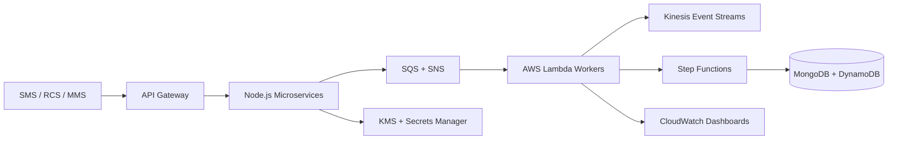

<h1 align="center">Ajay Yadav</h1>

  <strong>Principal Engineer | Backend Architecture | AWS Serverless | Event-Driven Systems</strong>

  <a href="mailto:ajaygeekcoder@gmail.com">ajaygeekcoder@gmail.com</a> |
  <a href="tel:+918109974494">+91 8109974494</a> |
  Delhi, India |
  <a href="https://linkedin.com/in/ajay-yadav-a7a495154">LinkedIn</a>

  
  
  

---

## About

Experienced engineer with 10+ years of experience designing and delivering scalable, cloud-native backend systems across fintech, logistics, and social impact domains. Proven expertise in event-driven architecture, serverless systems on AWS, and leading cross-functional engineering teams from requirements to production.

I have delivered high-impact platforms for global organizations including Google and Tata Trusts, with strong focus on maintainable architecture, reliable delivery, and business-aligned engineering execution.

---

## Core Strengths

<table>
  <tr>
    <td><strong>Backend Architecture</strong></td>
    <td>Microservices, REST APIs, GraphQL, serverless systems, event-driven platforms</td>
  </tr>
  <tr>
    <td><strong>AWS Cloud</strong></td>
    <td>Lambda, Step Functions, SQS, SNS, Kinesis, API Gateway, DynamoDB, S3, CloudWatch</td>
  </tr>
  <tr>
    <td><strong>Engineering Leadership</strong></td>
    <td>Team mentoring, code review, delivery ownership, sprint planning, client communication</td>
  </tr>
  <tr>
    <td><strong>Security & Reliability</strong></td>
    <td>JWT, OAuth 2.0, RBAC, KMS, Secrets Manager, OTP/2FA, monitoring, reconciliation</td>
  </tr>
</table>

---

## Technical Skills

### Languages & Runtime

### Backend & APIs

### Databases & Caching

### AWS & DevOps

---

## Experience

### Principal Engineer - Algoworks Technologies Private Limited

**Oct 2019 - Present**

- Served as Principal Engineer across concurrent enterprise products in fintech, logistics, and SaaS.
- Owned architecture, infrastructure, delivery planning, and production readiness for backend platforms.
- Worked directly with clients to translate business requirements into scalable technical roadmaps.
- Defined engineering standards, coding practices, and backend architectural patterns.
- Led and mentored teams of 4-6 engineers across SMSPayments, Trade Data Exchange, and ContractPlatformBuilder.
- Established GitLab CI/CD pipelines for automated testing, builds, and deployments.

### Senior Software Engineer - Dhwani Rural Information System

**Oct 2018 - Oct 2019**

- Delivered production-grade systems for Google and Tata Trusts social-impact platforms.
- Built survey and data collection systems with real-time ingestion, validation, and reporting.
- Worked independently with NGO and government program stakeholders under tight field deployment deadlines.
- Supported platforms used by thousands of rural field workers across India.

### Software Engineer - DSign Infosystems Private Limited

**Aug 2015 - Oct 2018**

- Built multiple client-facing projects from scratch across backend, database, and AWS layers.
- Worked directly with clients to gather requirements and deliver full-cycle software solutions.
- Developed strong foundations in Node.js, MongoDB, MySQL, Redis, AWS, and API design.

---

## Featured Projects

### 01. SMSPayments - Current

Enterprise-grade payment platform across SMS, RCS, and MMS channels.

- Led a backend team of 4-6 engineers across architecture, delivery, and infrastructure.
- Designed 30+ independently deployable microservices for payments, fraud, OTP, merchant onboarding, notifications, and reconciliation.
- Architected event-driven transaction processing using AWS SQS, SNS, Kinesis, Lambda, and Step Functions.
- Built real-time fraud detection and risk scoring with CloudWatch alarms and dashboards.
- Implemented OTP/2FA authorization, merchant onboarding, gateway integration, and reconciliation across MongoDB and DynamoDB.
- Managed serverless infrastructure using AWS SAM, KMS, Secrets Manager, API Gateway, and EC2.

**Stack:** Node.js, AWS Lambda, Step Functions, DynamoDB, SQS, SNS, Kinesis, API Gateway, CloudWatch, SAM, Serverless Framework, MongoDB, EC2, RCS, MMS, SMS, KMS, Secrets Manager

### 02. Trade Data Exchange

Secure B2B data exchange platform between enterprise clients.

- Led backend delivery and translated stakeholder requirements into technical architecture.
- Designed real-time data sync using GraphQL APIs and webhook-based event notifications.
- Built transformation and normalization layers for invoices, bills of lading, and shipment records.
- Optimized MongoDB and PostgreSQL aggregation pipelines for complex nested trade data.
- Secured API credentials and sensitive trade data using AWS Secrets Manager and AWS KMS.

**Stack:** Node.js, MongoDB, PostgreSQL, Redis, AWS S3, AWS EC2, AWS Lambda, GraphQL, REST APIs, Webhooks, AWS KMS, AWS Secrets Manager

### 03. ContractPlatformBuilder

Contract creation, templating, signing, and notification platform for small businesses.

- Worked as sole developer and architect for 2-10 small business clients.
- Designed dynamic contract templates with reusable structures and field-level validation.
- Implemented e-signature workflows with multi-role signing sequences and status tracking.
- Built RBAC for creators, reviewers, and signatories.
- Automated deadline reminders via AWS SES, AWS SNS, and Twilio.

**Stack:** Node.js, MongoDB, MySQL, Redis, AWS S3, AWS SES, AWS SNS, Twilio, JWT

### 04. InternetSaathi - Google & Tata Trusts

National-scale survey and analytics platform supporting rural digital literacy programs.

- Built core modules for a platform serving 30,000+ field workers and influencing 12 million women.
- Solved high-concurrency challenges from simultaneous survey submissions.
- Designed multi-tenant survey management for independent campaigns on a shared platform.
- Built reporting and analytics for stakeholders including Niti Aayog.
- Implemented data accuracy and deduplication pipelines at scale.

**Stack:** Node.js, Express.js, MongoDB, MySQL, Redis, REST APIs, JWT, AWS EC2, CSV Processing, Aggregation Pipelines, Caching

### 05. DELTA - Tata Trusts

Real-time mobile survey and program monitoring platform for field operations.

- Managed functional requirements and built core data modules.
- Engineered mobile-to-MongoDB real-time ingestion for live program monitoring.
- Built ad-hoc reporting and analytics for Tata Trusts program officers.
- Designed schemas and aggregations for complex hierarchical survey data.
- Implemented CSV streaming for bulk exports and offline analysis.

**Stack:** Node.js, Express.js, MongoDB, MySQL, Redis, REST APIs, JWT, AWS EC2, CSV Processing, Aggregation Pipelines, Caching

---

## Architecture Snapshot

---

## Education

**Bachelor of Technology, Honours**  
NRI Engineering College, Gwalior  
CGPA: 8.08 / 10 | 2011 - 2015

---

## Additional Information

| Area | Details |
| --- | --- |
| Total Experience | 10+ Years |
| Languages | English - Professional, Hindi - Native |
| Availability | Full-time, contract, and remote opportunities |

---

  <strong>Open to Principal Engineer, Backend Architect, Solution Architect, and Technical Lead opportunities.</strong>

